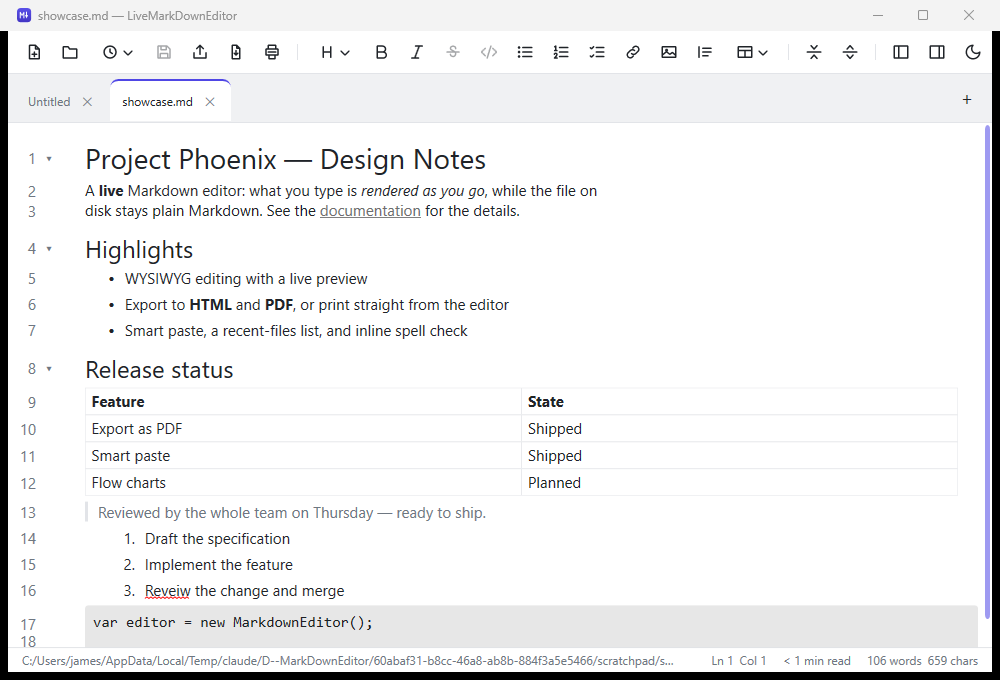
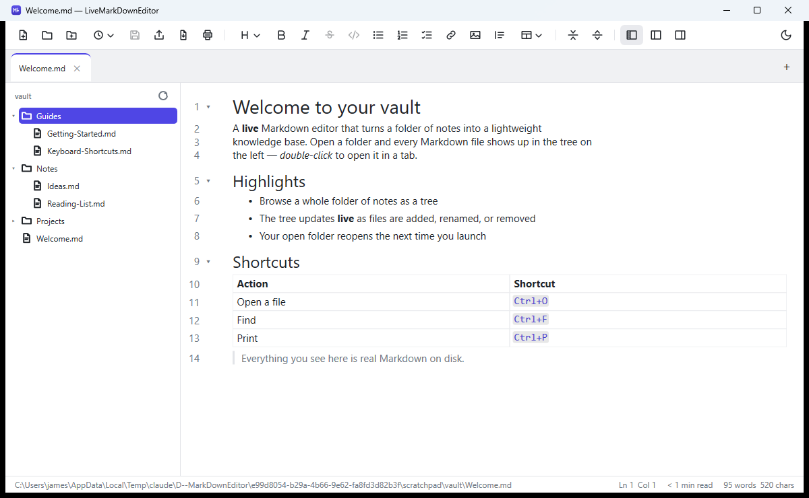
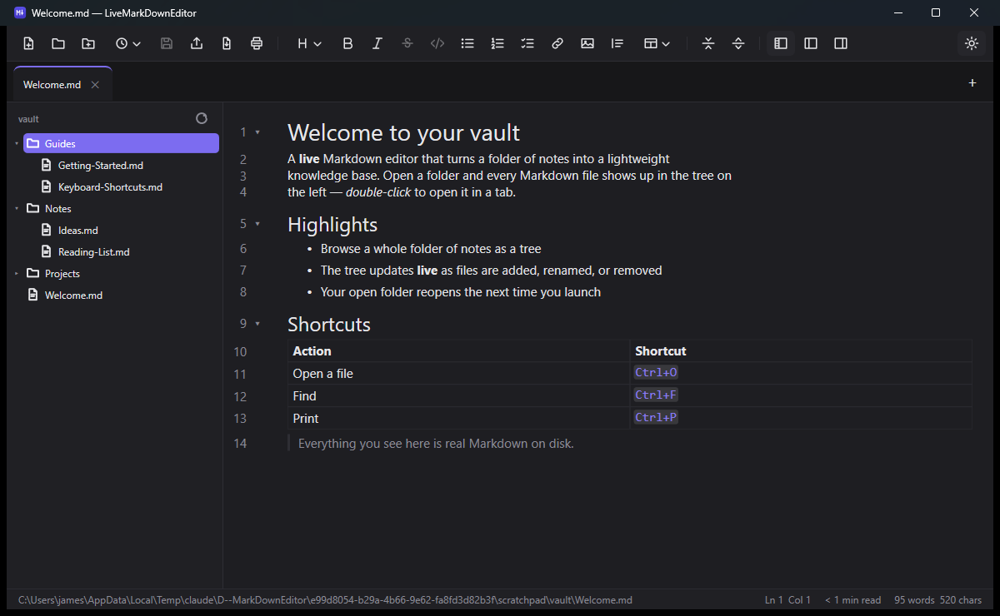
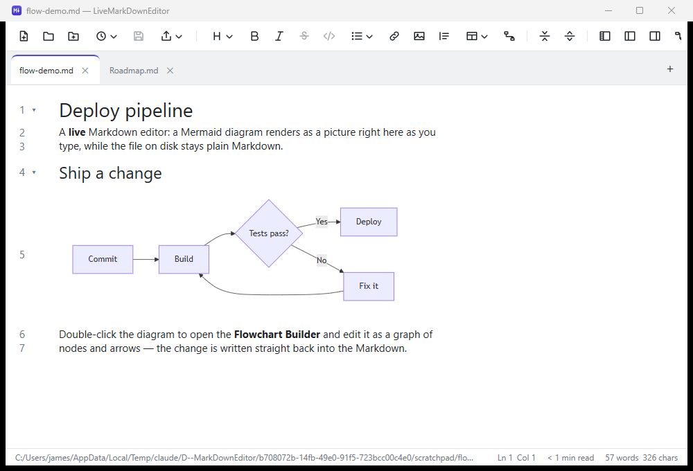
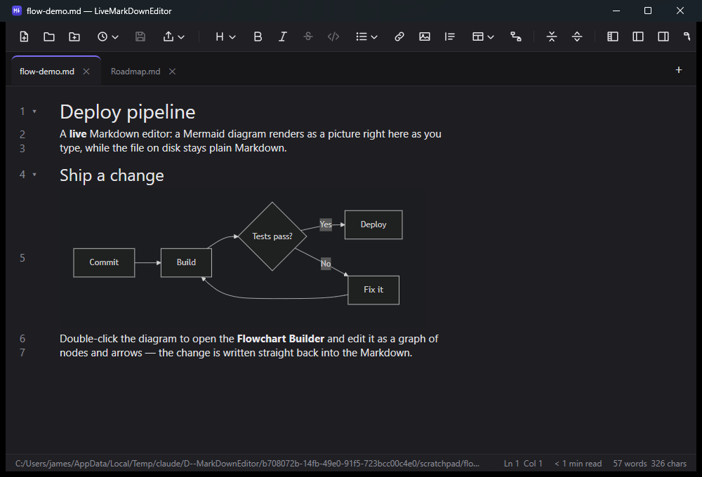
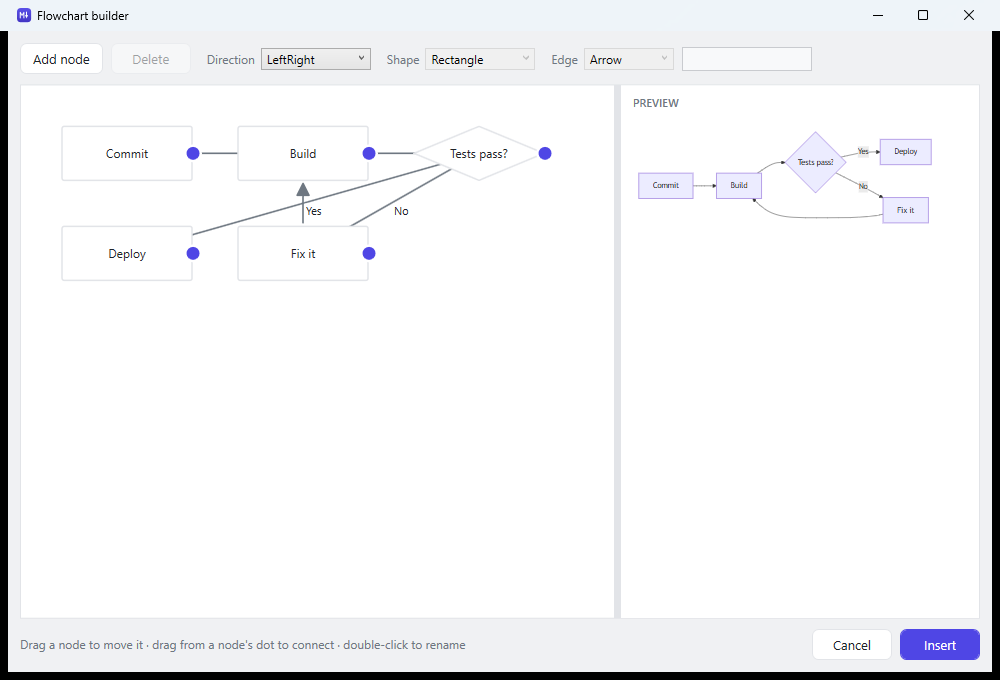
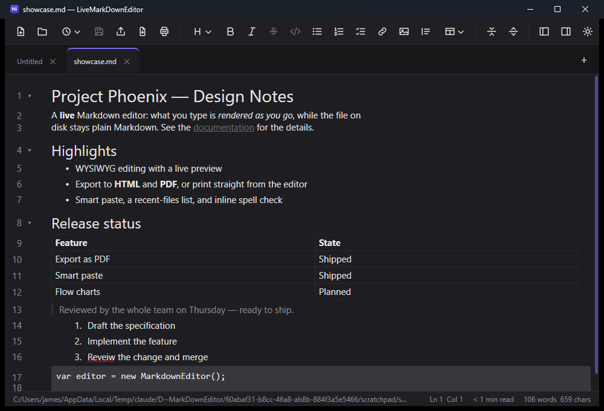

# LiveMarkDownEditor

A free, open-source **live** Markdown editor for Windows. You edit in a clean WYSIWYG
surface — formatting shows as formatting, never as raw `#` and `*` — while the file on disk
stays plain Markdown and updates live when it changes underneath you, even from another
person or tool.



## Features

### Folder workspace — a lightweight knowledge base

- **Open a folder** and browse its Markdown files as a tree; double-click a file to open it in a tab.
- The tree **updates live** as files are added, renamed, or removed on disk — by you or any tool —
  the same live behaviour that keeps an open document in sync.
- Only Markdown files show and folders with none are hidden, so a repository or vault stays tidy;
  your open folder **reopens** the next time you launch.





### Diagrams and flow charts

- Write a **Mermaid diagram** in a fenced code block tagged `mermaid` and it renders as a **picture
  right in the editor** — flowcharts, sequence, state, class, ER, gantt, and pie — while the file on
  disk stays plain Markdown.
- The picture **follows your theme**, light or dark, and re-renders as you edit the source. A diagram
  Mermaid can't draw falls back to showing its source, never a blank hole.
- **Double-click a flowchart** to open the **Flowchart Builder**: a drag-and-drop canvas of nodes and
  arrows with a live preview. Whatever you build is written straight back as canonical Mermaid source,
  so the text stays the single source of truth.
- Diagrams render in **exported HTML and PDF** too, and a toggleable preview pane shows the selected
  diagram larger.







### Write

- **WYSIWYG editing** — bold, italics, strikethrough, headings, links, images, inline code
  and code blocks, block quotes, and GitHub-flavored tables, each shown as itself.
- **Lists** — bulleted, numbered, and task lists with checkboxes you can tick.
- **Live source panel** — see and edit the raw Markdown side by side with the rendered view;
  the two stay in sync.
- **Find & replace**, section **folding**, and an **outline** navigation panel.
- **Spell check** with suggestions, and **Add to Dictionary** to accept a word permanently.

### Live updates

- The file is **watched**, so an edit made by another person or tool reloads into the editor
  as you watch. Conflicting edits are surfaced with a difference view — neither side is ever
  silently lost.
- **You see what changed.** A live reload briefly highlights the paragraphs the other writer
  touched, and marks where anything was deleted, so an edit by a colleague or an AI is something
  you can *see* rather than something that lands invisibly. It fades on its own, and it never
  moves your cursor or scrolls the page out from under you.

### Get content in and out

- **Export as HTML** — a standalone styled page, or a bare fragment to drop into another page.
- **Export as PDF**, or **print** straight from the editor (`Ctrl+P`).
- **Copy as rich text** so a selection pastes formatted into Word, Outlook, or a web editor —
  plus **Copy as Markdown** for pasting the source elsewhere.
- **Smart paste** — a URL pasted over a selection becomes a link, an image on the clipboard is
  saved beside your file and inserted, and pasted HTML converts to Markdown.

### Get around

- **Restore your workspace** on startup — the tabs you had open — plus a **recent-files** menu
  and a Windows taskbar **Jump List**.
- **`Ctrl`+Click** a link to follow it: a web address opens in your browser, a relative `.md`
  file opens in a new tab.
- A **status bar** with word and character counts, estimated reading time, the caret's line and
  column, and the current section.
- **Light and dark themes.**



## Building

Built on .NET 10 (WPF). From the repository root:

```
dotnet build MarkdownEditor.slnx
dotnet test MarkdownEditor.slnx
```
