# LiveMarkDownEditor

A free, open-source **live** Markdown editor for Windows. You edit in a clean WYSIWYG surface —
formatting shows as formatting, never as raw `#` and `*` — while the file on disk stays plain
Markdown and updates live when it changes underneath you, even from another person or tool.

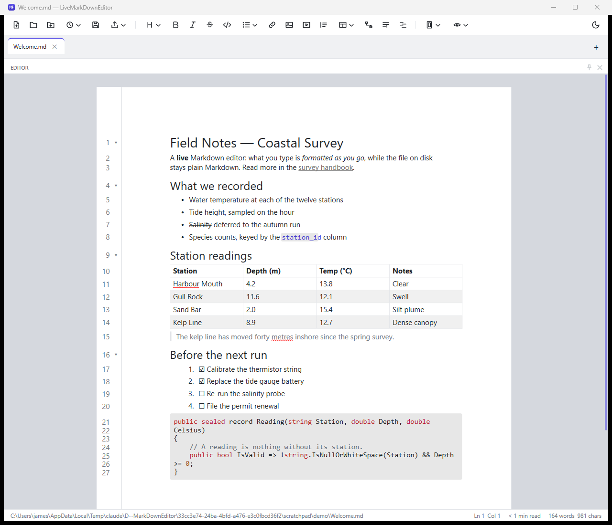

---

## Contents

- [Writing](#writing) · [Structure](#structure-and-layout) · [Diagrams](#diagrams)
- [Live updates](#live-updates) · [Navigating](#getting-around) · [Panels](#panels-and-layout)
- [Pages and printing](#pages-and-printing) · [Getting content in and out](#getting-content-in-and-out)
- [Writing aids](#writing-aids) · [Keyboard shortcuts](#keyboard-shortcuts) · [Building](#building)

---

## Writing

The editing surface is the document. A heading looks like a heading, bold looks bold, and the raw
Markdown is never in your way — but it is exactly what gets written to disk.

- **Headings** at all six levels, and back to a plain paragraph (`Ctrl+1`–`Ctrl+6`, `Ctrl+0`).
- **Bold**, *italic*, ~~strikethrough~~, and inline `code` — plus fenced **code blocks**.
- **Syntax highlighting** inside a code block, driven by the language on its fence.
- **Lists** — bulleted, numbered, and **task lists** with checkboxes you tick right in the document.
- **Links** and **images**, inserted through a prompt so a URL has somewhere to be typed.
- **Videos** — written with the image's own syntax (``) and played in place, with a
  play toggle, a scrubber, and the elapsed and total time.
- **Block quotes** and **thematic breaks**.
- **Tables** with a header row, per-column alignment, and add / remove row and column. Every other
  body row is shaded so the eye can follow a row across a wide table.
- **Footnotes** — cite one anywhere and the note lands in a footnote section at the end of the
  document, numbered for you.
- **Definition lists** for glossaries: a term flush to the margin, its definitions indented beneath.

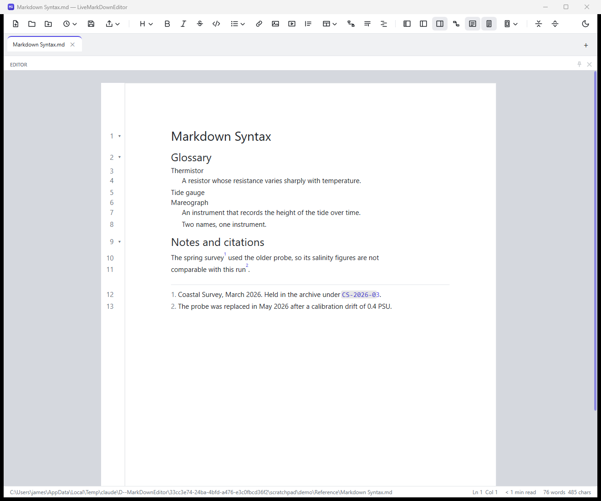

### The raw Markdown, when you want it

The **source panel** shows the document's own Markdown source beside the editor. Edit either one and
the other follows; scrolling either one scrolls the other to the same place.

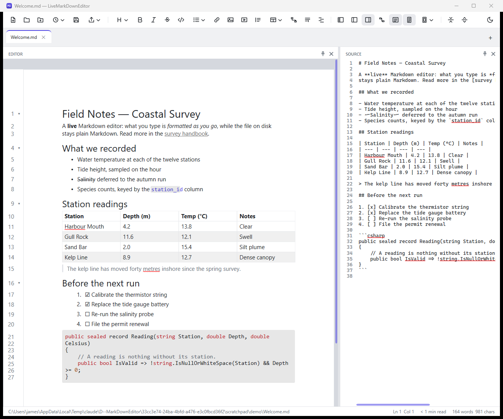

---

## Structure and layout

### Outline

The **navigation panel** lists every heading in document order, indented by level. Click one to jump
to it; the section you are editing stays highlighted as you move.

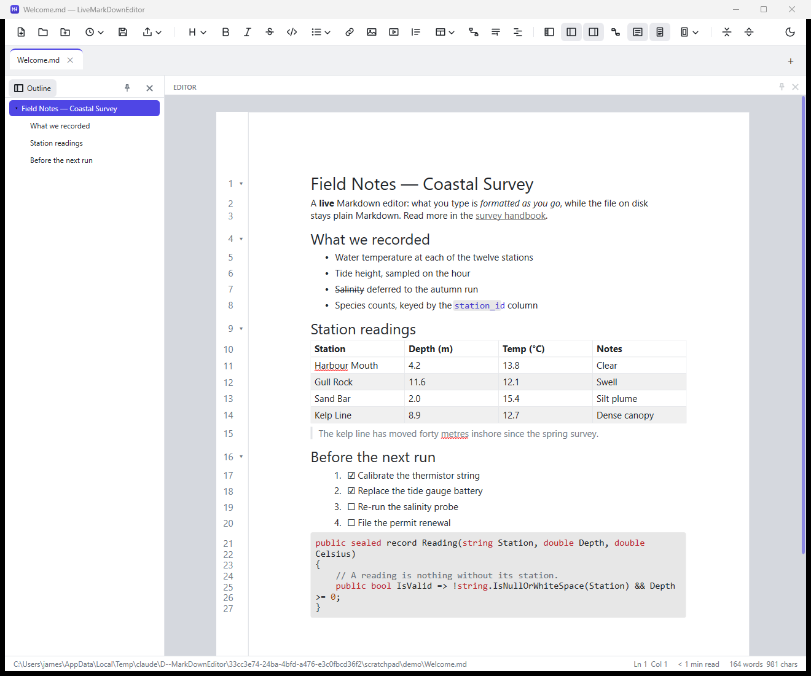

### Folding

Collapse a section to its heading and back, from the chevron in the gutter or from the command bar.
Fold state is a view of the document, never part of it.

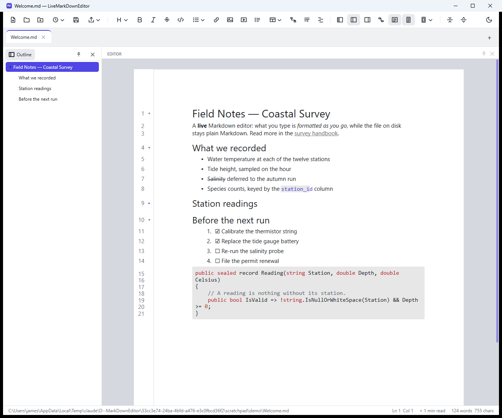

---

## Diagrams

Write a **Mermaid diagram** in a fenced code block tagged `mermaid` and it renders as a picture right
in the editor — flowcharts, sequence, state, class, ER, gantt, and pie — while the file on disk stays
plain Markdown. The picture follows your light or dark theme and re-renders as you edit. A diagram
Mermaid cannot draw falls back to showing its source, never a blank hole.

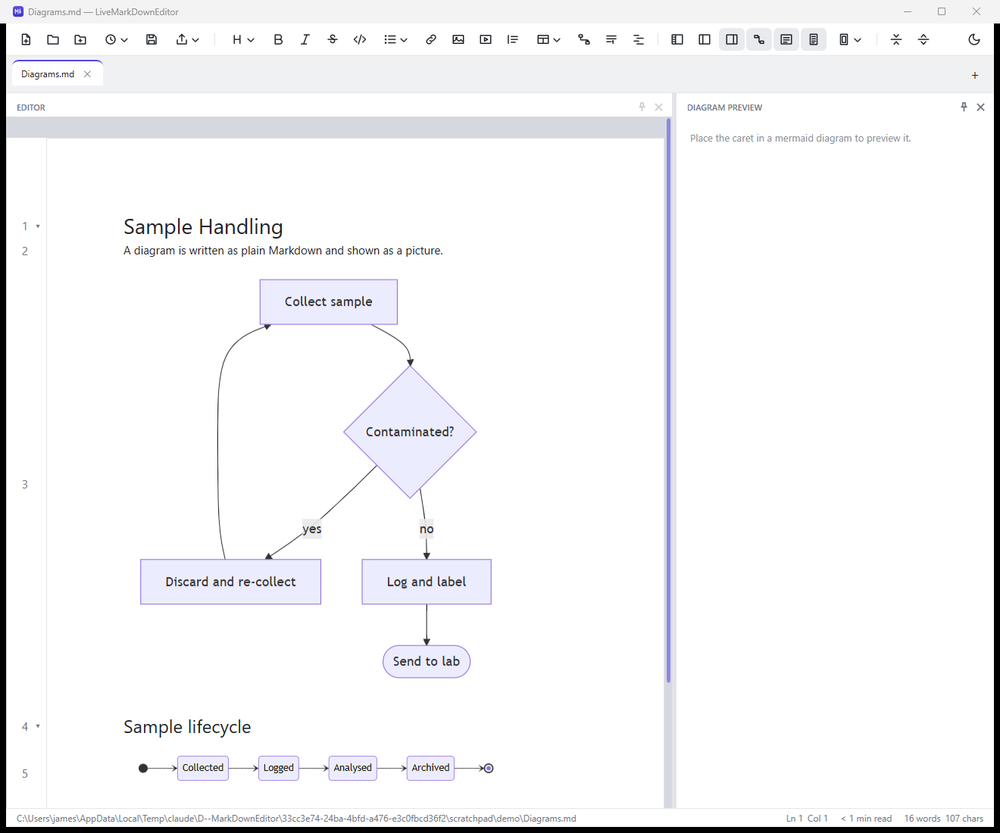

A toggleable **preview panel** shows the selected diagram larger.

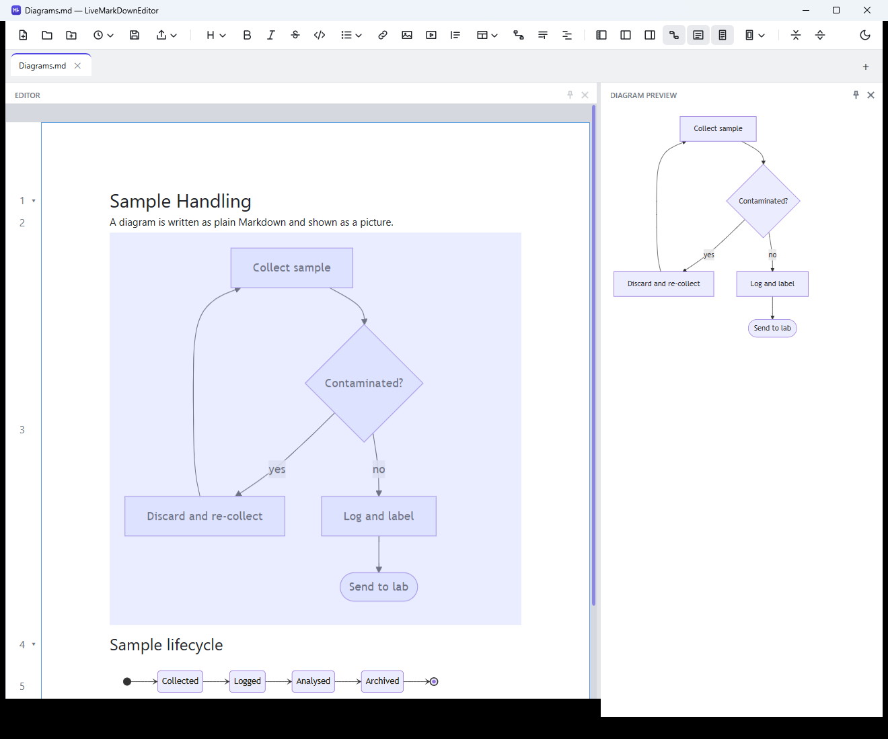

**Double-click a diagram** (or press `Ctrl+Shift+D`) to open the **Diagram Builder**: a drag-and-drop
canvas of nodes and arrows beside a live preview. It builds **flowcharts, state diagrams, class
diagrams and entity-relationship diagrams** — pick the kind and the shape and edge pickers follow,
with `[*]` start/end markers for states, inheritance and composition markers for classes, and
crow's-foot cardinalities for entities. Change your mind about the kind and the diagram comes with
you. Whatever you build is written straight back as canonical Mermaid source, so the text stays the
single source of truth.

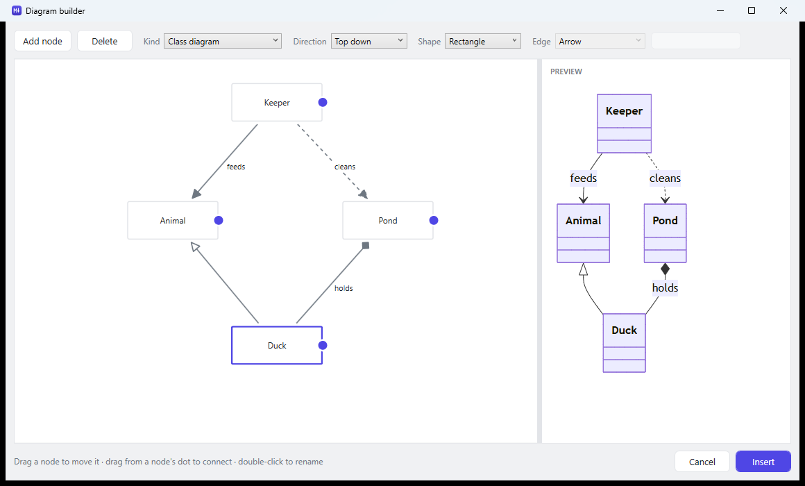

Diagrams render in exported HTML and PDF too.

---

## Live updates

This is the part the name is about. The file is **watched**, so an edit made by another person or
tool reloads into the editor as you watch.

**You see what changed.** A live reload briefly shades the paragraphs the other writer touched, and
marks with a thin rule where anything was deleted — so an edit by a colleague or an AI is something
you can *see* rather than something that lands invisibly. It fades on its own, and it never moves
your cursor or scrolls the page out from under you.

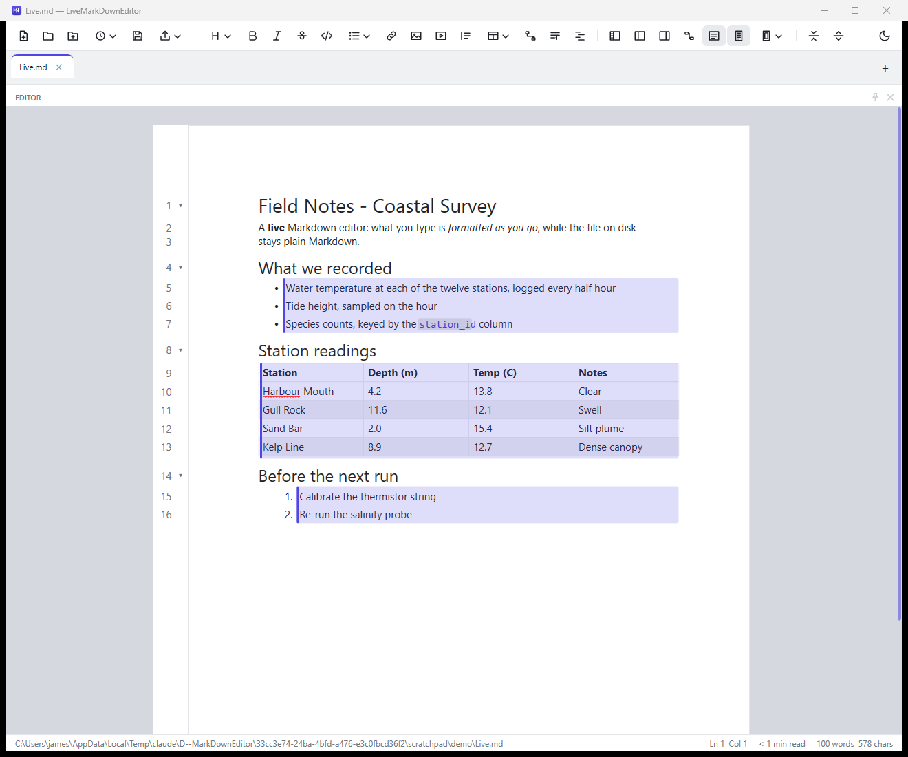

If the file changes while *you* have unsaved edits, nothing is silently lost. A bar offers the three
honest options — keep your edits, reload from disk, or look first.

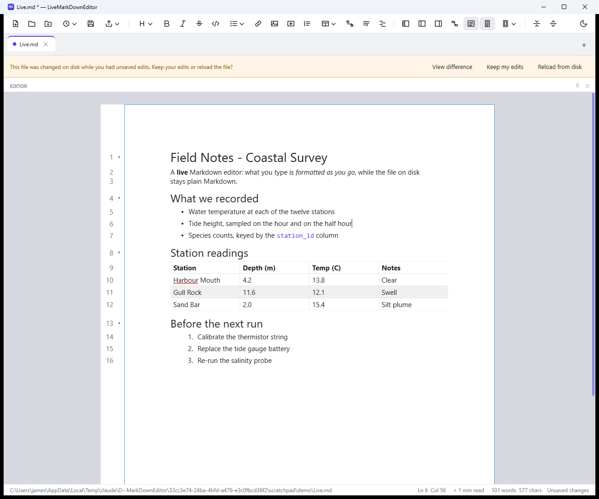

**View difference** lays your unsaved version against the one on disk, line by line.

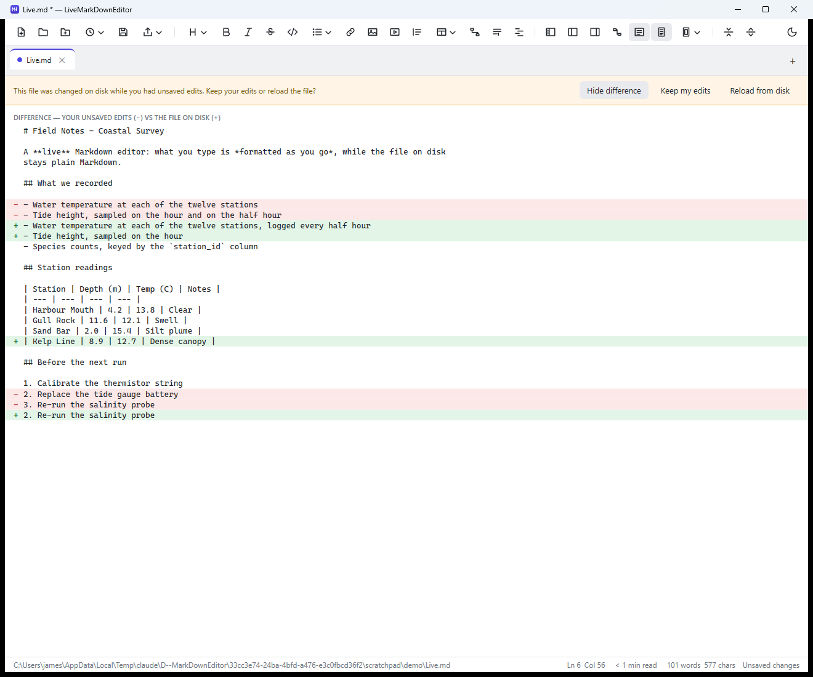

A change that rewrites the file's bytes without changing its content — another tool restyling
headings, say — raises no conflict and no reload at all.

---

## Getting around

- **Tabs** for every open document. **Pin** the ones you want to keep and they move to a row of their
  own, above the rest; *Close all but pinned* spares them. Pins survive a restart.
- A **tab tip** on hover names the file in full, which the tab itself has no room for.
- **Find and replace** (`Ctrl+F`, `Ctrl+H`) — every match highlighted, the current one shown as
  "3 of 12", and *Replace all* reaching inside collapsed sections too.
- **`Ctrl`+Click a link** to follow it: a web address opens in your browser, a relative `.md` file
  opens in a new tab.
- A **status bar** with word and character counts, estimated reading time, the caret's line and
  column, and the section you are in.
- **Recent files**, a Windows taskbar **jump list**, and file associations — double-click a `.md`
  file and it opens here, in the window that is already running rather than a second copy.

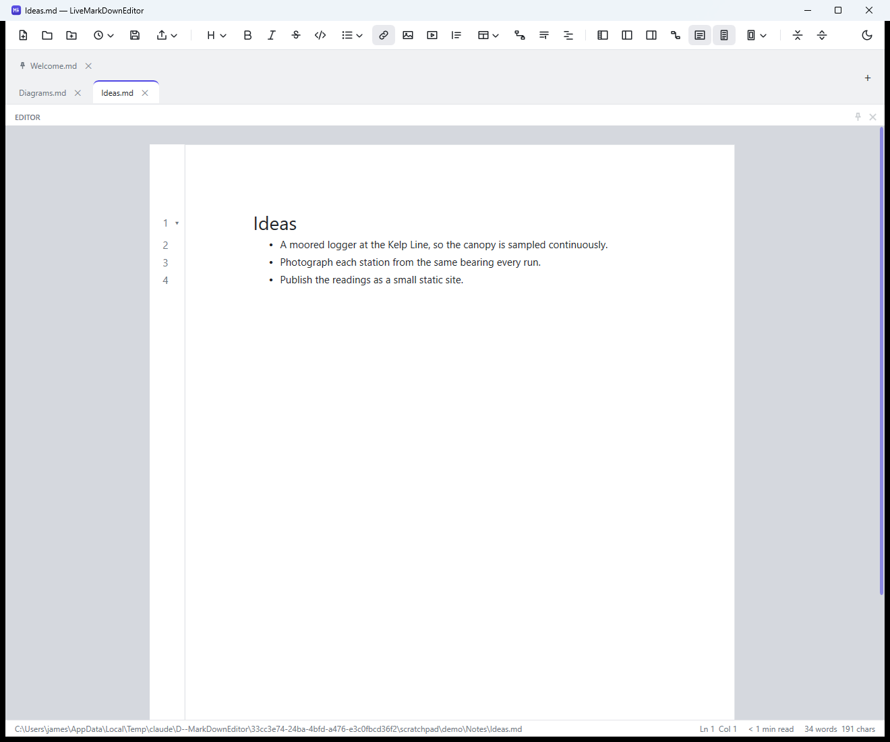

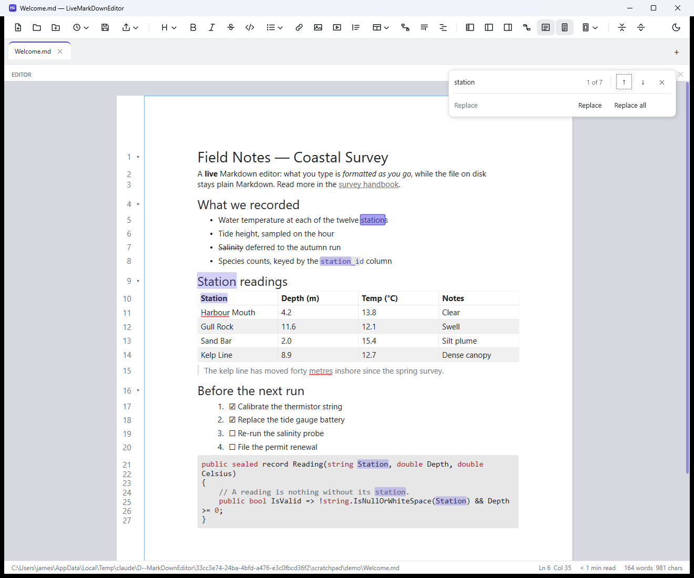

### Folder workspace — a lightweight knowledge base

Open a folder and browse its Markdown files as a tree; double-click a file to open it in a tab. The tree
**updates live** as files are added, renamed, or removed on disk — by you or any tool. Only Markdown
files show and folders with none are hidden, so a repository or vault stays tidy. Your open folder
reopens the next time you launch.

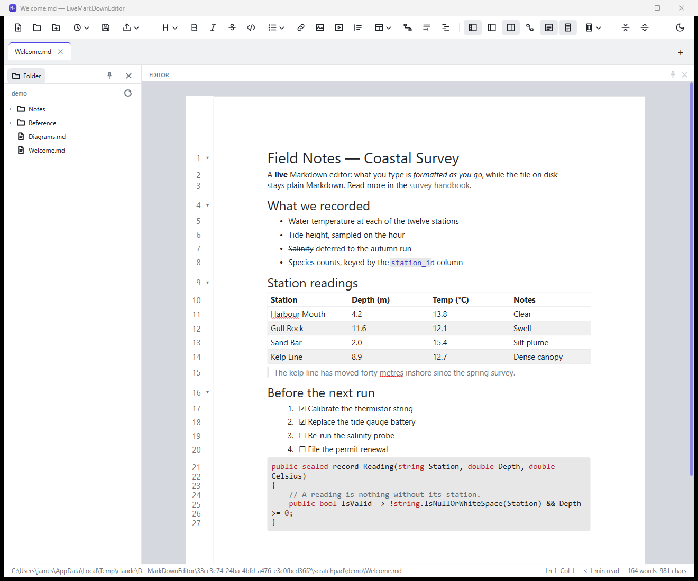

---

## Panels and layout

Every panel — the editor itself included — can be **docked**, **auto-hidden** to a tab on the window
edge, or **closed** and reopened from the view menu. Auto-hidden panels slide out over the editor
when you click their tab and slide away again. Drag the splitters to size them.

The layout is remembered: a panel left docked comes back docked, one left auto-hidden comes back
auto-hidden. Narrow the window and panels step out of the way one at a time rather than crushing the
editor — and step back in, exactly as you had them, when there is room again.

The **command bar** does the same: groups of icons collapse into dropdowns only when the row would
otherwise run off the edge.


---

## Pages and printing

**Page view** lays the document on a fixed-width sheet of whole 8.5 × 11 pages floating on a canvas,
the way a word processor does, with page breaks drawn where each page ends. **Page setup** sets the
orientation and the margins — normal, narrow, moderate, wide, or your own four numbers — and one
setting governs the screen, the preview, and the printed page alike.

**Print preview** shows the document laid out into the very pages printing would produce, including
anything hidden inside a folded section.

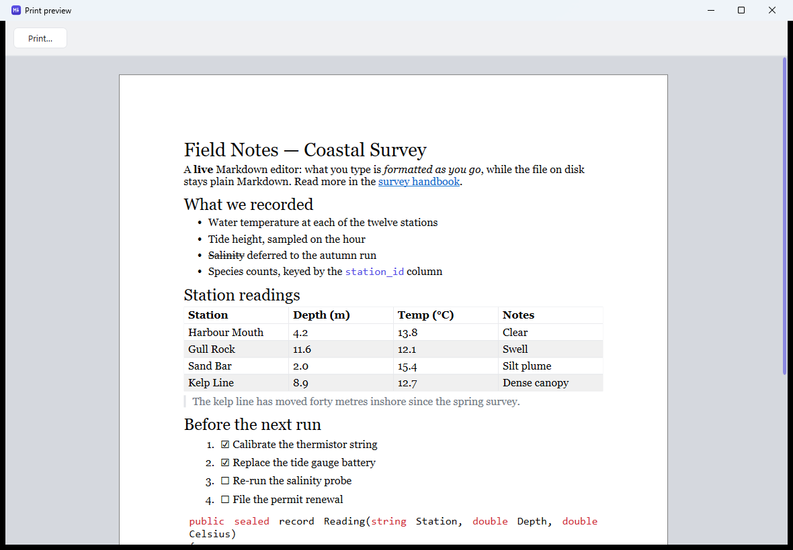

---

## Getting content in and out

- **Export as HTML** — a standalone styled page, or a bare fragment to drop into a page that supplies
  its own surroundings.
- **Export as PDF**, or **print** straight from the editor (`Ctrl+P`).
- **Copy as rich text** so a selection pastes formatted into Word, Outlook, Gmail or Slack — plus
  **Copy as Markdown** (`Ctrl+Shift+C`) for pasting the source elsewhere.
- **Smart paste** — a URL pasted over a selection becomes a link, an image on the clipboard is saved
  beside your file and inserted, pasted HTML converts to Markdown, and a copied code snippet lands as
  a code block with its indentation intact.

---

## Writing aids

**Spell check** marks misspellings as you write, aware enough to split a `camelCaseIdentifier` into
words and to skip code entirely. Right-click for suggestions, or **Add to Dictionary** to accept a
word permanently — it holds across runs.

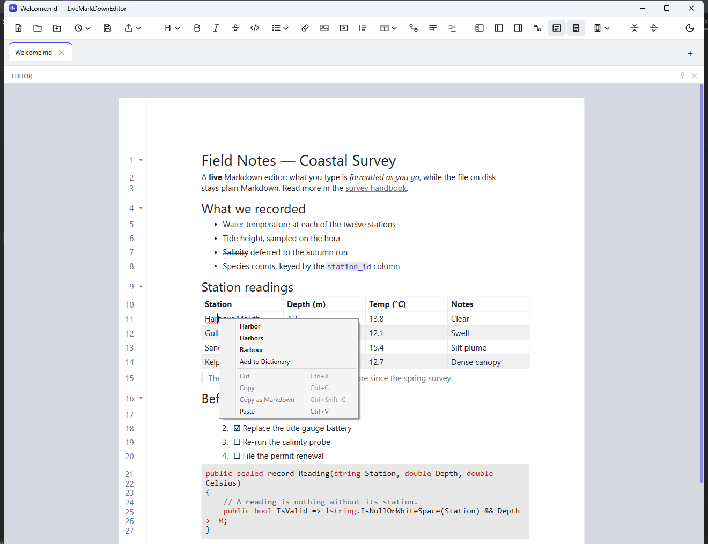

Every command bar action is an icon with a **command tip**: its name, what it does, and its key
gesture. Disabled actions show theirs too, so you can find out *why* something is unavailable.

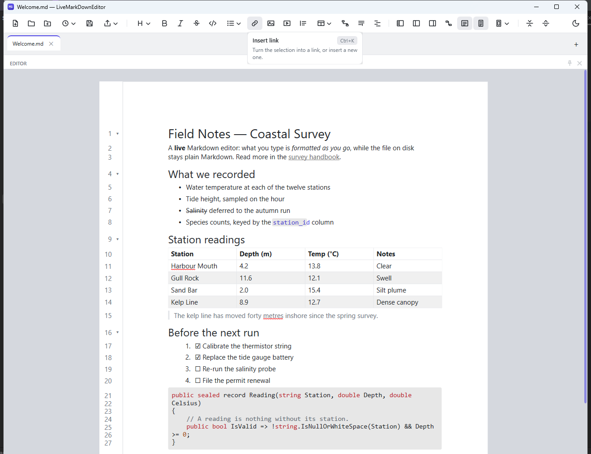

And there is a **dark theme**.

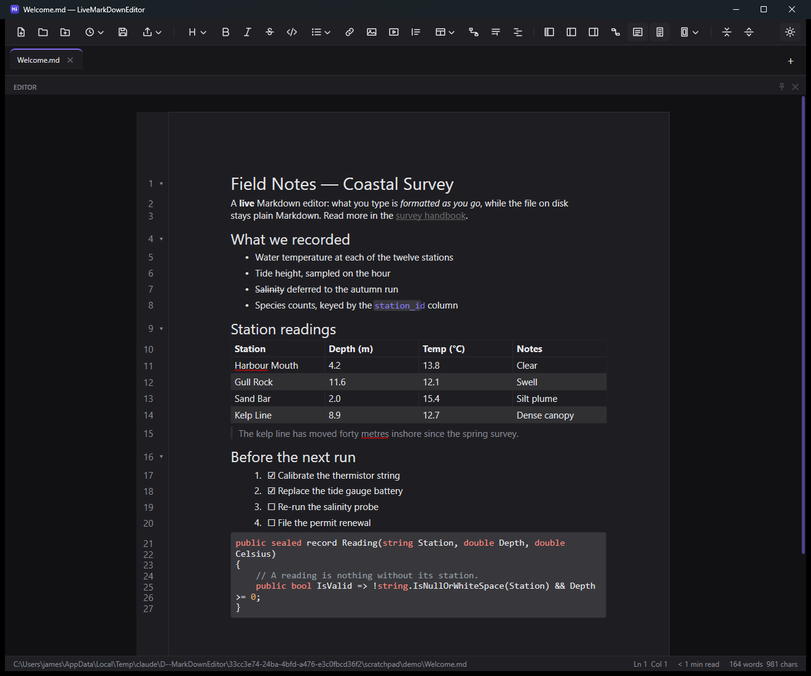

---

## Keyboard shortcuts

| | |
| --- | --- |
| `Ctrl+N` / `Ctrl+O` / `Ctrl+S` | New · Open · Save |
| `Ctrl+W` | Close tab |
| `Ctrl+1`…`Ctrl+6` / `Ctrl+0` | Heading level 1–6 · back to paragraph |
| `Ctrl+B` / `Ctrl+I` | Bold · Italic |
| `Ctrl+K` | Insert link |
| `Ctrl+Shift+D` | Diagram Builder |
| `Ctrl+F` / `Ctrl+H` | Find · Replace |
| `F3` / `Shift+F3` | Find next · Find previous |
| `Ctrl+M` / `Ctrl+Shift+M` | Fold the section at the cursor · Unfold every section |
| `Ctrl+Shift+C` | Copy as Markdown |
| `Ctrl+Shift+P` / `Ctrl+P` | Print preview · Print |
| `Ctrl`+Click | Follow a link |

---

## Building

Built on .NET 10 (WPF). From the repository root:

```
dotnet build MarkdownEditor.slnx
dotnet test MarkdownEditor.slnx
```

## Documentation

- **[How to use the editor](https://github.com/317jamtay317/LiveMarkDownEditor/wiki)** — the wiki, with
  a guide to every part of the app and a control reference.
- [docs/UbiquitousLanguage.md](docs/UbiquitousLanguage.md) and
  [docs/Invariants.md](docs/Invariants.md) are the authoritative domain documents; see
  [CLAUDE.md](CLAUDE.md) for how work is done in this repository.

## License

[MIT](LICENSE).
